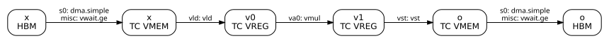

# HBM 与 TC VMEM 之间的 DMA

TensorCore 的向量单元只能读写 TC VMEM。数据在 HBM 中时，必须先由 DMA 搬进 TC VMEM；结果也要由 DMA 搬回 HBM。本节固定一个 TensorCore，看清一次 DMA 在机器清单中由哪些指令组成，再逐项改变 dtype、窗口和信号量，最后用 tpuasm 让硬件执行两种 Mosaic 拒绝编译的 DMA。



## 基本形式：一次 DMA 由三条指令组成

本小节实验[源码](01_pallas_f32_copy_64x128.py)、[输出](01_pallas_f32_copy_64x128.txt)。

`f32[64,128]` 经 TC VMEM 原样复制回 HBM，kernel 中只有两次 `async_copy(...).wait()`。输入方向在清单中是：

```text
{ s0: @p0 dma.simple [vmem:s7], [hbm:s0], length=64, dst_flag=[sflag:52] }
{ misc: @p0 vwait.ge [sflag:52], 64 }
{ misc: @p0 vsyncadd.s32 [sflag:52], -64 }
```

- `dma.simple` 发起传输，操作数依次是目的地址、源地址、长度，以及完成时累加的同步标志 `dst_flag`。Pallas 的 DMA semaphore 就是这里的 `sflag:52`。
- `vwait.ge` 让 TensorCore 停在原地，直到同步标志不小于 64。
- `vsyncadd.s32 ... -64` 把标志减回 0，供下一次 DMA 复用。

`async_copy(...)` 对应第一条指令，`.wait()` 对应后两条。发起和等待是两个独立的事件：`dma.simple` 发出后 TensorCore 立即继续发射后面的 bundle，DMA 引擎在后台搬运；等待只在 `vwait.ge` 处发生。这个实验没有计算，所以清单中没有 `vld`/`vst`：DMA 只改变数据所在的内存，不经过 TC VREG。

本例的 DMA 指令都带谓词 `@p0`。这次编译器没有像第 1 节那样用分支跳过主体，而是先用 `seq.s32 p0, s6, 0` 判断 TensorCore 编号是否为 0，再给主体的每条指令加上谓词：TensorCore 1 照样经过这些 bundle，但其中的指令都不执行。

## DMA 的长度单位：512 B 的 granule

本小节实验[源码](02_pallas_dtype_payload_64x128.py)、[输出](02_pallas_dtype_payload_64x128.txt)。

只改 dtype，shape 固定为 `[64,128]`：

| dtype | 字节数 | `length` |
| --- | ---: | ---: |
| f32 | 32768 | 64 |
| bf16 | 16384 | 32 |
| int8 | 8192 | 16 |

三行都满足 `字节数 = length × 512`。DMA 的长度以 512 B 为单位，本教程称为 granule。等待指令的阈值也用同一单位：`vwait.ge [sflag:52], 64` 等的是 64 个 granule 全部到达。下一节会看到，一个 f32 TC VREG 是 4096 B，即 8 个 granule。granule 是 DMA 的计量单位，不能拿来数 TC VREG。

## 只改源和目的：HBM 直接复制到 HBM

同一实验的第二个 kernel 不分配 TC VMEM，直接 `async_copy(x_hbm, o_hbm, sem)`：

```text
{ s0: @p0 dma.general [hbm:s1], [hbm:s0], length=64, stride_descriptor=[smem:0x0], stride_count=0,
      src_flag=[sflag:s8], dst_flag=[sflag:s7], ici_dest=s9 }
```

DMA 不要求一端是 TC VMEM。HBM→HBM 复制用的是更通用的 `dma.general`，它多了 `src_flag` 和 `ici_dest` 等操作数。

> 暂且可以理解为：`dma.general` 可以把数据送到另一个 TensorCore 甚至另一颗芯片，`ici_dest` 指定目的地。第二章第 4、5 节详细介绍这些远程 DMA。

## 只改窗口：行窗口与列窗口

本小节实验[源码](03_pallas_f32_windows.py)、[输出](03_pallas_f32_windows.txt)。

输入改为 HBM 中的 `f32[64,256]`，每次只搬一个窗口到 TC VMEM，再写回输出的同一位置。窗口起点在清单中是一条加在基址上的 `sadd.s32`：

| 窗口 | 源地址偏移 | DMA |
| --- | ---: | --- |
| `[16:32, :]` | 32 | `dma.simple ... length=32` |
| `[:, 128:256]` | 8 | `dma.strided ... length=64, src_stride=16, dst_stride=8, elements_per_stride=8` |

这两组数字说明了 HBM 中数组的存放方式：数组被切成 `8×128` 的 tile（每个 4096 B，即 8 个 granule），tile 按行优先顺序连续存放。`f32[64,256]` 每行 tile 有 2 个，于是：

- 行窗口 `[16:32, :]` 是第 2、3 行 tile，起点为 `2 × 2 × 8 = 32` 个 granule，4 个 tile 连续，一次 `dma.simple` 搬 32 个 granule。
- 列窗口 `[:, 128:256]` 是每行 tile 中的第 2 个，起点为 8 个 granule。8 个 tile 不连续，所以改用 `dma.strided`：每段搬 8 个 granule，源每段前进 16 个 granule，目的每段前进 8 个 granule。

窗口变了，DMA 的形式就跟着变，但仍然是一条指令，不需要逐 tile 发起多次 DMA。

## Mosaic 拒绝的窗口，硬件可以执行

同一实验中的另外两个窗口无法编译：

```text
9 行窗口 [8:17, :]：Slice sizes along tiled dimensions must be aligned to tiles. ...
非对齐行起点 [3:11, :]：Offsets along tiled dimensions must be aligned to tiles. ...
```

这是 Mosaic 的校验规则：在分块存放的维度上，窗口的起点和大小必须是 tile 的整数倍。它不等于硬件限制。上一小节已经看到，HBM 地址和 DMA 长度的单位都是 granule；对只有一列 tile 的数组，一个 granule 恰好是一行 128 个 f32，相邻的行就是相邻的 granule。

本小节实验[源码](04_tpuasm_unaligned_rows.py)、[输出](04_tpuasm_unaligned_rows.txt)。

做法是先让 Mosaic 编译一个合法的对齐版本作为载体，再用 tpuasm 改写机器清单中的几个数，重新汇编后装载运行。

非对齐起点：载体读 `f32[64,128]` 的 `x[8:16]`，地址计算是 `sadd.s32 s9, 8, s0`。把立即数 8 改成 3，改写后的 executable 输出逐元素等于 `x[3:11]`。

9 行窗口：载体读 `x[8:24]`。把输入 DMA 的 `length=16` 改成 9，同时把紧随其后的 `vwait.ge ... 16` 和 `vsyncadd ... -16` 改成 9 和 -9，输出的前 9 行逐元素等于 `x[8:17]`。

第二个改写必须同时修改等待阈值。DMA 完成时只给同步标志加上实际搬运的 granule 数；若只改 `length` 而保留 `vwait.ge ... 16`，TensorCore 会永远等不到第 16 个 granule。这也印证了上面的结论：同步标志按 granule 计数。

这两个改写不是推荐的日常写法，而是在回答一个问题：DMA 引擎能否以单个 granule 为粒度选择起点和长度。答案是能，限制来自 Mosaic 的校验。需要这种访问模式时，就可以考虑用 tpuasm 绕过校验。数组有多列 tile 时，非对齐的行窗口在 HBM 中不再连续，需要 `dma.strided` 来描述。

## 只改信号量数量：等待可以合并

本小节实验[源码](05_pallas_two_inputs_async.py)、[输出](05_pallas_two_inputs_async.txt)。

kernel 依次发起 x、y 两个输入 DMA，再依次等待，然后相加：

```python
x_copy = pltpu.async_copy(x_hbm, x_vmem, sems.at[0])
y_copy = pltpu.async_copy(y_hbm, y_vmem, sems.at[semaphores - 1])
x_copy.wait()
y_copy.wait()
```

两个输入各用一个信号量时，两次等待分别是 `vwait.ge [sflag:52], 64` 和 `vwait.ge [sflag:53], 64`。共用一个信号量时，两条 `dma.simple` 都写 `sflag:52`，编译器把两次等待合并成一条：

```text
{ s0: dma.simple [vmem:s10], [hbm:s0], length=64, dst_flag=[sflag:52] }
{ s0: dma.simple [vmem:s13], [hbm:s1], length=64, dst_flag=[sflag:52] }
{ misc: vwait.ge [sflag:52], 128 ;
  misc: vsyncadd.s32 [sflag:52], -128 }
```

同步标志只是一个计数器：它统计已到达的 granule 总数，不记录是哪一次 DMA 送来的。共用信号量时，TensorCore 无法只等 x 而不等 y。需要“x 一到就开始计算”时，就要给 x 单独的信号量。第二章会用这一点组织软件流水线。

两条 `dma.simple` 都在任何等待之前发出，所以两次传输可以同时进行。DMA 要多少时间、两次传输同时进行能节省多少，属于计时问题。

> 暂且可以理解为：一次 HBM→TC VMEM 的 DMA 有约 480 个周期的固定开销，之后每 KiB 约 1.1 个周期。第二章第 2 节给出各方向 DMA 的实测代价模型，第三章第 4–5 节介绍如何测得这些数字。

## 对照：原生 XLA 的 DMA

本小节实验[源码](06_jax_f32_64x128.py)、[输出](06_jax_f32_64x128.txt)。

XLA 对 `f32[64,128] × 2` 生成的 fusion 中，DMA 是 `dma.strided ... length=32`，而 `vld`、`vmul.8x128.f32`、`vst` 各只有 4 条，正好是全部 8 个 tile 的一半。开头的指令解释了原因：

```text
{ s1: sld s6, [smem:0x1] }
{ s0: sshll.u32 s7, s6, 0x5 }
```

XLA 读出 TensorCore 编号后乘以 32（左移 5 位），作为 HBM 地址的 granule 偏移：TensorCore 0 处理第 0–31 行，TensorCore 1 处理第 32–63 行。与第 1 节只有一个 tile 的例子不同，这次 XLA 让两个 TensorCore 各算一半，清单中的计数是每个 TensorCore 各执行一份。

> 暂且可以理解为：XLA 会自动把一颗芯片上的工作分给两个 TensorCore。第二章第 1 节详细介绍这种分工，以及 Pallas 中如何显式地做到同样的事。

另外，XLA 的每次 DMA 都带越界检查（`shalt`），并把行窗口写成 `dma.strided`，而 Pallas 对连续的窗口直接用 `dma.simple`。
