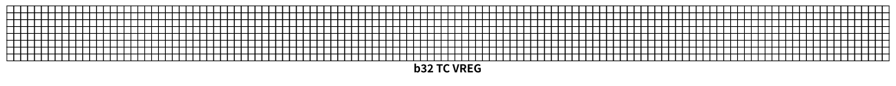
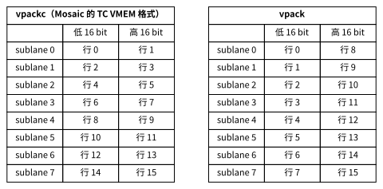

# 向量布局与打包

本节回答：一个数组进入 TensorCore 的向量寄存器以后，元素怎样摆放。先看 f32，再只改 dtype 看 bf16 怎样把两个元素装进一个 32 bit 位置，最后只改 shape，看不整除寄存器大小的数组怎样处理。

## 基本形式：一个 TC VREG 是 8×128 个 32 bit

本小节实验[源码](01_pallas_scale_64x128.py)、[输出](01_pallas_scale_64x128.txt)。

TPU v4 TensorCore 的一个向量寄存器（TC VREG）由 8 个子通道（sublane）、每个子通道 128 个通道（lane）组成，每个位置 32 bit，共 4096 B：



一个 f32 数组按 `8×128` 的 tile 切开，每个 tile 恰好装满一个 TC VREG：行对应 sublane，列对应 lane。

实验沿用第 1 节的最小 kernel，只把输入改为 `f32[64,128]`。`f32[64,128]` 有 8 个 tile，清单中 `vld.8x128`、`vmul.8x128.f32`、`vst.8x128` 各 8 条，每个 tile 一组。助记符中的 `8x128` 就是指令处理的形状：一条向量指令一次处理一整个 TC VREG。

TC VMEM 的地址也按这个结构编排。8 个 `vld` 的地址依次是 `[vmem:0x0]`、`[vmem:0x8]`、……、`[vmem:0x38]`：相邻 tile 相差 8，一个地址单位是一个子通道的 128 个 32 bit，即 512 B。这与第 3 节 DMA 的 granule 大小相同，但两者属于不同的指令，不要混用。

## 只改 dtype：bf16 两个元素共用一个 32 bit 位置

同一实验对 `bf16[64,128]` 再编译一次，kernel 不变：`x_vmem[...] * 2` 在 bf16 输入上同样成立。清单中的向量指令变为：

| 指令 | f32 | bf16 |
| --- | ---: | ---: |
| `vld.8x128` | 8 | 4 |
| `vunpackl.8x128.f16.f32` | 0 | 4 |
| `vunpacku.8x128.f16.f32` | 0 | 4 |
| `vmul.8x128.f32` | 8 | 8 |
| `vpackc.8x128.f32.f16` | 0 | 4 |
| `vst.8x128` | 8 | 4 |

bf16 每个元素 16 bit，一个 32 bit 位置装两个元素，一个 TC VREG 装 `16×128` 个 bf16。`bf16[64,128]` 只需 4 次 load 和 4 次 store。

但乘法仍然是 8 条 `vmul.8x128.f32`：TPU v4 的向量 ALU 没有 bf16 算术。每个打包的 TC VREG 先用 `vunpackl`、`vunpacku` 展开成两个 f32 TC VREG，在 f32 中计算，再用 `vpackc` 合回一个。逻辑元素数没有变，算术量也没有减半；减半的只是 load/store 和 TC VMEM 占用。

清单中还能看到，8 条 `vmul` 全部在 `va0` 槽，而 unpack 分布在 `va0` 和 `va1`。查 [tpuasm 的指令索引](../../../tpuasm/docs/references/tpu_v4_tc_isa.md) 可知，`vmul.8x128.f32` 只能在 `va0` 发射，`vadd.8x128.f32` 只能在 `va1` 发射。这一点在第 6 节还会遇到。

int8 的同一 kernel 无法编译：

```text
Not implemented: Only vector<i16> and vector<i32> are supported, but got 'i8'. Please cast your input.
```

Mosaic 不支持 int8 向量运算，int8 数据要先转换成 int32 再计算，见第 5 节。

## 打包格式：哪两个元素共用一个位置

本小节实验[源码](02_pallas_bf16_packing.py)、[输出](02_pallas_bf16_packing.txt)。

要回答“`bf16[16,128]` 的第几行和第几行共用一个 32 bit 位置”，最直接的办法是把 TC VREG 按位重新解释成 `u32[8,128]`，读出每个 32 bit 的高低两半各是哪个元素。kernel 主体改为：

```python
o_vmem[...] = pltpu.bitcast(x_vmem[...], jnp.uint32)
```

`pltpu.bitcast(值, dtype)` 不改变任何 bit，只改变解释方式；位宽变大时，行数相应变少，`bf16[16,128]` 变为 `u32[8,128]`。清单证实它没有产生任何指令，只有 1 条 `vld` 和 1 条 `vst`。

输入的第 r 行第 c 列的 bf16 位型设为 `r × 256 + c`，读出的结果是：

```text
u32 第 s 个 sublane 的低 16 bit 来自 bf16 的第 [0, 2, 4, 6, 8, 10, 12, 14] 行
u32 第 s 个 sublane 的高 16 bit 来自 bf16 的第 [1, 3, 5, 7, 9, 11, 13, 15] 行
列号不变
```

即第 s 个子通道装第 `2s` 行（低 16 bit）和第 `2s+1` 行（高 16 bit）。数组从 HBM 经 DMA 原样进入 TC VMEM，这也是 bf16 数组在 HBM 中的格式。由此可以推出 unpack 的含义：`vunpackl` 展开第 0–3 个子通道，得到第 0–7 行的 f32；`vunpacku` 展开第 4–7 个子通道，得到第 8–15 行。第 5 节的 bf16→f32 转换实验把这两个结果分别写成输出的第 0–7 行和第 8–15 行，数值与 XLA 完全一致，印证了这个推论。

## 硬件有两种打包格式

本小节实验[源码](04_tpuasm_bf16_pack_formats.py)、[输出](04_tpuasm_bf16_pack_formats.txt)。

指令索引中，打包指令有 `vpack.8x128.f32.f16` 和 `vpackc.8x128.f32.f16` 两条，Mosaic 只用了后者。为了弄清前者做什么，实验先编译一个 kernel，把第 r 行全为 r 的 `f32[16,128]` 转为 bf16，再按位读出：

```python
o_vmem[...] = pltpu.bitcast(x_vmem[...].astype(jnp.bfloat16), jnp.uint32)
```

清单中的打包指令是 `vpackc.8x128.f32.f16 v2, v1, v0`。然后用 tpuasm 把这条指令改成 `vpack.8x128.f32.f16`，其余不变，重新汇编后运行。两次的结果：



```text
vpackc：sublane s 的 (低 16 bit, 高 16 bit) = [(0, 1), (2, 3), (4, 5), (6, 7), (8, 9), (10, 11), (12, 13), (14, 15)]
vpack ：sublane s 的 (低 16 bit, 高 16 bit) = [(0, 8), (1, 9), (2, 10), (3, 11), (4, 12), (5, 13), (6, 14), (7, 15)]
```

- `vpackc` 把相邻两行放进同一个位置。这是 Mosaic 在 TC VMEM 和 HBM 中使用的格式，与上一小节的读数一致。
- `vpack` 把相隔 8 行的两行放进同一个位置：装第 0–7 行的 f32 TC VREG（`v0`）的第 s 个子通道进入低 16 bit，装第 8–15 行的（`v1`）的第 s 个子通道进入高 16 bit。

两种格式的位置对应关系不同，混用会把行打乱。手写 kernel 时，只要数据既不来自也不去往 Mosaic 管理的内存（例如只在寄存器内部打包、交给另一条指令使用），就可以选择对下游更方便的格式。

## 只改 shape：不整除 8×128 的数组

本小节实验[源码](03_pallas_f32_unaligned.py)、[输出](03_pallas_f32_unaligned.txt)。

最小 kernel 的输入改为 `f32[9,130]`，其余不变。物理容量仍按完整的 tile 分配：

```text
ceil(9 / 8) × ceil(130 / 128) = 2 × 2 = 4 个 tile
```

清单中有 4 条 `vld` 和 4 条 `vmul`，与 tile 数一致。不同的是边界：

```tpuasm
vld v3, [vmem:0x0]           # 第 0–7 行，第 0–127 列
vld v5, [vmem:0x8]           # 第 0–7 行，第 128–129 列所在的 tile
vld v7, [vmem:0x10, sm=1]    # 第 8 行，第 0–127 列
vld v9, [vmem:0x18, sm=1]    # 第 8 行，第 128–129 列所在的 tile
...
vst     [vmem:0x0], v4
vst.msk [vmem:0x8], vm0, v6
vst     [vmem:0x10, sm=1], v8
vst.msk [vmem:0x18, sm=1], vm2, v10
```

这里出现了两种掩码：

- `sm=` 是子通道掩码，按 bit 选择 8 个子通道中的哪些参与 load/store。`sm=1` 只选第 0 个子通道，即第 9 行（下标 8）。完整的 tile 不写 `sm`，等价于 8 个子通道全选。
- `vm0`、`vm2` 是向量掩码寄存器，每个元素一个 bit，`vst.msk` 只写掩码为 1 的元素。

掩码由前面几条向量指令现场生成：

```tpuasm
vlaneseq.8x128.u32 v0         # 每个位置的序号 sublane × 128 + lane
vand.8x128.u32  v1, 0x7f, v0  # lane = 序号 & 127
vshrl.8x128.s32 v2, v0, 0x7   # sublane = 序号 >> 7
vlt.8x128.s32   vm0, v1, 2    # lane < 2：第 128、129 列
veq.8x128.s32   vm1, v2, 0    # sublane == 0
vmand.8x128.u1  vm2, vm1, vm0 # 两者同时成立
```

因此不整除的 shape 不会多读写有效区以外的元素，但要付出额外的掩码指令；而 `vld` 和 `vmul` 仍然处理完整的 tile，padding 部分的计算照样发生，只是结果不写回。设计数据布局时，让 shape 整除 `8×128`（bf16 为 `16×128`）可以省去这些指令。

v4 只有 `vm0` 到 `vm7` 八个向量掩码寄存器。

> 暂且可以理解为：向量掩码寄存器很少，同时活跃的掩码超过 8 个时，编译器要把掩码转存到 TC VREG 中再取回。第 6 节详细介绍比较、选择与掩码寄存器的使用。
