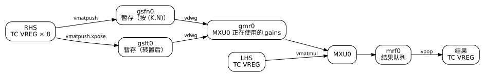

# 矩阵乘法与 MXU

矩阵乘法由 TensorCore 的矩阵单元 MXU 完成。本节从最小的 `bf16[16,128] @ bf16[128,128]` 出发，看清 MXU 的数据怎样进出、内部有哪些状态；再只改 RHS 的存放方向、dtype、M、N、K；最后用 Pallas 的低层接口显式控制 MXU，并用 tpuasm 查明和修正这条接口在 TPU v4 上的错误。



## 写法：kernel 中的 jnp.dot

本小节实验[源码](01_pallas_dot.py)、[输出](01_pallas_dot.txt)；两输入 kernel 的构造和统计函数在 [mxu_common.py](mxu_common.py) 中。

相对于第 1 节的最小 kernel，输入改为 lhs 和 rhs 两个，输出为 f32，计算改为：

```python
o_vmem[...] = jnp.dot(lhs_vmem[...], rhs_vmem[...], preferred_element_type=jnp.float32)
```

`preferred_element_type` 指定结果的 dtype。bf16 输入不写它时，结果也是 bf16，会多一次舍入；矩阵乘法的累加通常需要 f32 结果。

## 基本形式：push、装入、乘、取回

`bf16[16,128] @ bf16[128,128]` 的结果与精确值逐元素一致，清单中的矩阵指令是：

```text
8 × vmatpush.packed.8x128.f16 gsfn0, v      # RHS 的 8 个打包 TC VREG 送入暂存区 gsfn0
1 × vdwg.128x128.f16 gmr0, gsfn0            # 暂存区整块装入 MXU0 的 gains 寄存器 gmr0
1 × vmatmul.packed.8x128.f16 mrf0, v        # 一个打包 LHS TC VREG（16 行）送入 MXU0
2 × vpop.8x128 v, mrf0                      # 结果每 8 行一个 f32 TC VREG，从 mrf0 取回
```

两个操作数的地位不对称：

- RHS（`128×128`）先成为 MXU 的一部分状态。8 次 push 把它送进暂存区，`vdwg` 再把整块装入 gains 寄存器 GMR。只有装入之后，MXU 才用它计算。
- LHS 一个 TC VREG 一次：每条 `vmatmul` 用当前 GMR 中的 RHS 乘一个 LHS TC VREG，结果进入队列 MRF，再由 `vpop` 取回。

几个细节：

- **一次 push 一个打包的 TC VREG。** bf16 的 RHS `128×128` 是 8 个打包的 TC VREG，每个 16 行，所以要 8 次 `vmatpush.packed`。`gsfn0` 是 MXU0 的暂存区，push 的顺序就是 RHS 的行序（K 方向）。
- **`vdwg` 一次装入整块。** 暂存区收齐 128 行之后，`vdwg` 把它整块装进 MXU0 的 gains 寄存器 `gmr0`。暂存区与 gains 分开，意味着可以在 MXU 用旧 gains 计算的同时，把下一份 RHS push 进暂存区。
- **一次 `vmatmul` 乘一个 LHS TC VREG。** `vmatmul.packed` 送入一个打包的 LHS TC VREG（16 行 × 128 列），与 gains 中的 `128×128` 相乘，得到 16 行 × 128 列的 f32 结果。f32 的 TC VREG 只能放 8 行，所以结果分两次 `vpop` 取回。
- **结果是 f32。** MXU 内部按 f32 累加 128 个乘积，`preferred_element_type=jnp.float32` 时直接取回 f32；不写时编译器还要多一次舍入把结果变回 bf16。

由此可见 MXU 适合的使用方式：一份 RHS 装入一次，然后连续乘很多块 LHS。装入 RHS 要 8 次 push 加 1 次 `vdwg`，而每多一块 LHS 只要 1 次 `vmatmul` 和 2 次 `vpop`。

> 暂且可以理解为：`vmatmul` 之后要过一段时间，第一条依赖它的 `vpop` 才能发射；期间可以继续发射其他 `vmatmul`。第三章第 6 节测得：MXU0、MXU1 是 83 个周期（[研究报告 55](../../../pallas-tpu-readings-dev/research_reports/55_tpu_v4_mrf_latency.md) 测得 MXU2、MXU3 是 101 个周期）；同一个 MXU 每 8 个周期接收一个 8 行的 LHS TC VREG，即每周期一行。按这个速率，一个 TensorCore 的 4 个 MXU 每周期完成 4 × 128 × 128 = 65536 次乘加。

## 只改 RHS 方向：push 时转置

RHS 以 `(N,K)` 存放（例如权重按输出通道存放），计算 `lhs @ rhs.T`：

```python
o_vmem[...] = jnp.dot(lhs_vmem[...], rhs_vmem[...].T, preferred_element_type=jnp.float32)
```

清单中没有出现第 9 节的 `vxpose`，而是 push 换成了 `vmatpush.packed.xpose`，目的地换成另一个暂存区 `gsft0`，`vdwg` 也从 `gsft0` 装入：

```text
8 × vmatpush.packed.xpose.8x128.f16 gsft0, v
1 × vdwg.128x128.f16 gmr0, gsft0
```

转置在 push 通路上完成，不需要先在 TC VMEM 中转置一次。每个 MXU 有两个暂存区：`gsfn` 存按 `(K,N)` 送入的 RHS，`gsft` 存 push 时转置的 RHS；`vdwg` 指明从哪一个装入。

## 只改 dtype：f32 输入的精度

输入改为带小数的 f32，结果与三种参考比较（误差除以结果的最大绝对值）：

| 写法 | 与 f64 精确结果 | 与“只有 RHS 先舍入成 bf16” | 与“两侧都先舍入成 bf16” |
| --- | ---: | ---: | ---: |
| 默认 | 2.2e-3 | 1.3e-3 | 1.1e-7 |
| `precision=jax.lax.Precision.HIGHEST` | 1.0e-7 | 1.6e-3 | 2.3e-3 |

默认情况下，结果与“两侧都先舍入成 bf16 再乘”一致：TPU v4 的 MXU 以 bf16 计算，f32 输入只保留 bf16 的精度。清单印证了这一点：RHS 先经 8 次 `vpackc` 打包成 bf16 才 push；LHS 虽然用 `vmatmul.8x128.f32` 直接送入 f32，结果却与两侧舍入一致。

`jnp.dot(..., precision=jax.lax.Precision.HIGHEST)` 得到 f32 的精度，代价是多次计算：把每个 f32 拆成高位和低位两个 bf16（`vmatpush.hi`/`vmatpush.low`、`vmatmul.hi`/`vmatmul.low`），12 次 `vmatmul` 代替 2 次，再用 10 次 `vadd.f32` 把部分积相加。需要 f32 精度的矩阵乘法，在 TPU v4 上要付出数倍的 MXU 时间。

int8 的矩阵乘法无法编译：`Unsupported matmul RHS type on target: vector<128x128xi8>`。指令索引中有 `vmatpush.byte.8x128.s8` 等 int8 形式的 push，但 Mosaic 在 TPU v4 上不生成它们。

## 只改 M、N、K：四个 MXU

| 运算 | 用到的 MXU | 每个 MXU 的 push / vdwg / vmatmul / vpop | 其他 |
| --- | --- | --- | --- |
| `[16,128] @ [128,128]` | 1 | 8 / 1 / 1 / 2 | |
| `[128,128] @ [128,128]` | 4 | 8 / 1 / 2 / 4 | |
| `[16,256] @ [256,128]` | 2 | 8 / 1 / 1 / 2 | 2 次 `vadd.f32` |
| `[16,128] @ [128,256]` | 2 | 8 / 1 / 1 / 2 | 重新打包 RHS |

一个 TensorCore 有 4 个 MXU（`gmr0`–`gmr3`、`mrf0`–`mrf3`）：

- M 增大（16 → 128 行）：同一份 RHS 被分别 push 进 4 个 MXU，每个 MXU 处理 2 块 LHS。RHS 的装入次数随 MXU 数增加，所以只有 LHS 足够多时，占满 4 个 MXU 才划算。
- K 增大（128 → 256）：RHS 的两半 `[0:128, :]` 和 `[128:256, :]` 分别装入两个 MXU，两个部分积在 MRF 取回后由 2 次 `vadd.f32` 相加（结果 16 行，即 2 个 f32 TC VREG，各加一次）。K 方向的累加由向量单元完成：TPU v4 的 MXU 不在内部累加不同 RHS 块的结果，`pltpu.get_tpu_info()` 报告的 `num_accumulators` 为 0。K 每多 128，就多一次部分积的取回和一次向量加法。
- N 增大（128 → 256）：RHS 的左右两半装入两个 MXU，两个结果分别是输出的左右两半，不需要相加。清单中多出的 16 次 unpack 和 pack 用于把 `bf16[128,256]` 的 RHS 重新打包成两个 `128×128` 块。

所以 MXU 的基本单位是一个 `128×128` 的 RHS 块。更大的矩阵被切成这样的块，块的装入与复用方式就是矩阵乘法 kernel 的核心设计问题。

## 显式控制 MXU：公开接口的错误

本小节实验[源码](02_pallas_mxu_fifo.py)、[输出](02_pallas_mxu_fifo.txt)。

`jnp.dot` 由编译器决定 RHS 何时装入、装入哪个 MXU。Pallas 还提供了显式控制的接口，可以只 push 一次 RHS，再用它乘多块 LHS：

```python
pltpu.matmul_push_rhs(rhs_vmem[...], staging_register=0, mxu_index=0)
for block in range(2):
    rows = pl.ds(block * 16, 16)
    pltpu.matmul_lhs_fifo(lhs_vmem[rows, :], mxu_index=0, load_staged_rhs=0 if block == 0 else None)
    o_vmem[rows, :] = pltpu.matmul_pop_fifo(shape=(16, 128), dtype=jnp.float32, mxu_index=0)
```

- `matmul_push_rhs` 把 RHS 送入第 `mxu_index` 个 MXU 的暂存区；`transpose=True` 时 push 时转置。
- `matmul_lhs_fifo` 送入一块 LHS；`load_staged_rhs=0` 表示先把暂存区中的 RHS 装入 gains 再乘，`None` 表示继续用当前的 gains。
- `matmul_pop_fifo` 取回结果。

在当前环境中，这两个用法的结果都是错的：

| 用法 | 第 0 块 | 第 1 块 |
| --- | --- | --- |
| RHS 复用 | 正确 | 全零 |
| RHS 以 `(N,K)` 存放（`transpose=True`） | 全零 | 全零 |

清单直接说明了原因：

```text
8 × vmatpush.packed.8x128.f16 gsfn0, ...            # 转置时为 vmatpush.packed.xpose ... gsft0
vmatmul.packed.dwg.8x128.f16 (gmr0, gsfn0, mrf0), v8
vmatmul.packed.8x128.f16 mrf0, v9
```

与 `jnp.dot` 的清单相比，这里没有单独的 `vdwg`，取而代之的是第一次乘法带 `.dwg` 后缀，目的操作数多了 `gmr0, gsfn0`。转置的情况更明显：RHS 被 push 进 `gsft0`，带 `.dwg` 的乘法却指向 `gsfn0`。

## 用 tpuasm 查明并修正

本小节实验[源码](03_tpuasm_mxu_fifo_fix.py)、[输出](03_tpuasm_mxu_fifo_fix.txt)。

结果全零或部分正确，说明计算用的 gains 不是本次 push 的 RHS。为了区分“用了哪一份”，实验在被测 kernel 之前先运行一个正确的 `jnp.dot` kernel，它把另一份 RHS（记作 other）装入 MXU0。之后被测 kernel 的每块结果，可以判断为正确、等于 `lhs @ other`（用了上一个 kernel 留下的 gains），或全零：

| 用法 | 版本 | 第 0 块 | 第 1 块 |
| --- | --- | --- | --- |
| RHS 复用 | 原样 | 用了上一个 kernel 的 RHS | 正确 |
| RHS 复用 | 修正后 | 正确 | 正确 |
| RHS 以 `(N,K)` 存放 | 原样 | 用了上一个 kernel 的 RHS | 全零 |
| RHS 以 `(N,K)` 存放 | 修正后 | 正确 | 正确 |

由此可以确定带 `.dwg` 的 `vmatmul` 的含义：这次乘法仍用此前已装入的 gains，乘完之后才从指定的暂存区装入新的 gains，供后面的乘法使用。Mosaic 把装入放在了第一次乘法“之后”，所以第一块用的是旧 gains；转置时又指错了暂存区（`gsfn0` 而非 `gsft0`），装入的是空的暂存区，第二块全零。上一小节在新进程中得到的组合（第 0 块正确、第 1 块全零）与此不同，说明原样版本的结果取决于运行前 MXU 中残留的状态；这一组合的确切成因本节不再追究。

修正方法与 `jnp.dot` 生成的指令一致：在第一次乘法之前插入一条独立的 `vdwg`，从正确的暂存区装入，两次乘法都去掉 `.dwg`：

```python
fixed = tpuasm_tools.insert_bundles(
    tpuasm_tools.replace_listing(serialized, lambda source: source.replace(DWG_MATMUL, 'vmatmul.packed.8x128.f16 mrf0')),
    {pc: f'{{ vx0: vdwg.128x128.f16 gmr0, {staging} }}'},
)
```

`replace_listing` 做等长的文本替换；`insert_bundles` 在原第 `pc` 个 bundle 之前插入一个新 bundle，tpuasm 自动调整其后的分支和元数据。修正后两种用法的两块结果都正确；修正版本在进程中最先运行、此前没有其他 kernel 装入过 gains 时，结果同样正确。

这个例子集中体现了本教程的方法：公开接口给出的程序是错的，但硬件能力本身完好；机器清单让错误一目了然，tpuasm 让我们不必等待上游修复，就能得到正确的显式 MXU 控制。

## 对照：原生 XLA

本小节实验[源码](04_jax_dot.py)、[输出](04_jax_dot.txt)。

XLA 的矩阵乘法与 Pallas 是同一套做法：push、`vdwg`、`vmatmul.packed`、`vpop`，RHS 转置时同样用 `vmatpush.packed.xpose` 和 `gsft0`，f32 输入同样先打包成 bf16（9 条 `vpackc`：8 条给 RHS，1 条给 LHS）。`[16,128] @ [128,128]` 是 8 次 push、1 次 `vmatmul.packed`、2 次 `vpop`；`[128,128] @ [128,128]` 时用 4 个 MXU，各装入一份 RHS、各乘 2 块、各取回 4 次。在矩阵乘法上，手写 kernel 相对 XLA 的余地不在单次乘法的指令，而在数据怎样送到 MXU 跟前（第二章第 9 节）。
